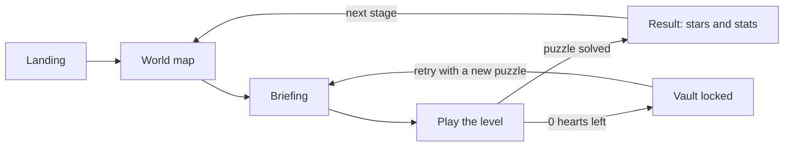
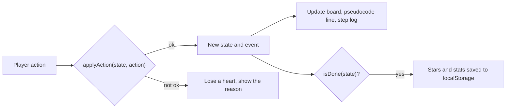

<div align="center">

# Chaos Vault

**Learn searching and sorting by performing every step yourself.**

An algorithmic puzzle-RPG for the browser. Eight classic algorithms, one move at a time, and a vault that checks every step.

[](https://chaos-vault.vercel.app/)

[](LICENSE)
[](https://github.com/Adi-Marathe/chaos-vault/commits/main)
[](https://github.com/Adi-Marathe/chaos-vault/stargazers)
[](#contributing)

<br />


</div>

---

## Contents

- [About](#about)
- [Screenshots](#screenshots)
- [How to play](#how-to-play)
- [Levels](#levels)
- [Features](#features)
- [Tech stack](#tech-stack)
- [Getting started](#getting-started)
- [How it works](#how-it-works)
- [Project structure](#project-structure)
- [Roadmap](#roadmap)
- [Contributing](#contributing)
- [License](#license)
- [Credits](#credits)

## About

Most algorithm sites let you watch a bar chart sort itself. **Chaos Vault makes you do it.**

Every level is a small puzzle in which you perform one algorithm by hand (open, probe, compare, swap, split, merge, drop) and the game checks each move against the real algorithm. A wrong move costs a heart and tells you why. Finish with hearts to spare and you earn stars.

It covers two searching and six sorting algorithms, each with its own board, rules and theme:
**Linear Search, Binary Search, Bubble Sort, Selection Sort, Insertion Sort, Merge Sort, Shell Sort and Radix Sort.**

## Screenshots

<table>
  <tr>
    <td align="center"><br /><sub>Landing</sub></td>
    <td align="center"><br /><sub>World map</sub></td>
  </tr>
  <tr>
    <td align="center"><br /><sub>Playing Bubble Belt</sub></td>
    <td align="center"><br /><sub>Result screen</sub></td>
  </tr>
</table>

## How to play

1. Pick a stage on the **world map**. Stages unlock in order.
2. Read the **briefing** (mission, allowed actions, par time), then press **Start**.
3. **Perform the algorithm** with the action buttons, the board, or the keyboard shortcuts shown on the buttons.
4. Every move is checked. A correct move scores; a wrong move costs one of your **3 hearts** and shows a one-line reason.
5. Solve the puzzle to clear the stage. If the hearts run out, the vault locks and you retry with a freshly generated puzzle.



**Scoring**

| Stars | How to earn them |
|:--:|---|
| ★☆☆ | Clear the stage |
| ★★☆ | Clear it with no mistakes |
| ★★★ | No mistakes, and finish under the par time |

> [!NOTE]
> Progress is saved in your browser (`localStorage`, key `chaosVault.v1`). Clearing site data resets it, or use **Reset progress** on the world map.

## Levels

| Stage | Zone | Level | Algorithm | Your job |
|:--:|---|---|---|---|
| 1-1 | Seeker Woods | Lantern Sweep | Linear Search | Open crates one by one, left to right, until you find the target |
| 1-2 | Seeker Woods | Halving Door | Binary Search | Probe the middle of what is left and discard half each time |
| 2-1 | Sorting Foundry | Bubble Belt | Bubble Sort | Compare neighbours on a conveyor and choose Swap or Skip |
| 2-2 | Sorting Foundry | Crane Pick | Selection Sort | Pick the smallest tile in the unsorted zone; it swaps to the front |
| 2-3 | Sorting Foundry | Card Hand | Insertion Sort | Slide the drawn card left until it fits, then place it |
| 3-1 | Divide Peaks | Zipper Lanes | Merge Sort | Split down to single tiles, then zip lanes together by taking the smaller front tile |
| 3-2 | Divide Peaks | Gap Jumper | Shell Sort | Jump tiles back by the current gap (4, 2, 1), or place them |
| 4-1 | Digit Docks | Mail Docks | Radix Sort | Drop each parcel into the bin for its current digit, collect bins 0 to 9, repeat per digit |

<details>
<summary><b>Complexity cheat sheet</b></summary>

<br />

| Algorithm | Best | Average | Worst | Space | Stable |
|---|---|---|---|---|:--:|
| Linear Search | O(1) | O(n) | O(n) | O(1) | n/a |
| Binary Search | O(1) | O(log n) | O(log n) | O(1) | n/a |
| Bubble Sort | O(n) | O(n²) | O(n²) | O(1) | Yes |
| Selection Sort | O(n²) | O(n²) | O(n²) | O(1) | No |
| Insertion Sort | O(n) | O(n²) | O(n²) | O(1) | Yes |
| Merge Sort | O(n log n) | O(n log n) | O(n log n) | O(n) | Yes |
| Shell Sort | O(n log n) | depends on the gaps | O(n²) with Shell's gaps | O(1) | No |
| Radix Sort (LSD) | O(d·(n + k)) | O(d·(n + k)) | O(d·(n + k)) | O(n + k) | Yes |

Binary Search needs sorted data. Radix Sort never compares two values with each other; it sorts digit by digit.

</details>

## Features

- **Learn by doing:** eight hand-played levels with strict, step-by-step move validation.
- **Instant feedback:** every mistake comes with a one-line reason.
- **Live pseudocode:** a pseudocode panel highlights the current line, and a step log records each move.
- **A fresh puzzle every attempt:** puzzles come from a seeded random generator, so you cannot memorize them.
- **Stars and par times:** 3 hearts per attempt and 3-star scoring.
- **World map:** six zones, sequential unlocking, progress saved locally.
- **Polished UI:** a chunky neo-brutalist look, Framer Motion animations and confetti on a clear. Reduced-motion preferences are respected.
- **Tested engines:** every algorithm is a pure, unit-tested state machine.

## Tech stack

| Layer | Choice |
|---|---|
| UI | React 18 (JSX) on Vite |
| Routing | React Router |
| Animation | Framer Motion, canvas-confetti |
| Icons | Lucide React |
| Styling | Plain CSS, one file per component, design tokens as CSS variables |
| Tests | Vitest |
| Storage | `localStorage` (no backend, no login) |
| Hosting | Vercel |

## Getting started

**Prerequisites:** Node.js 20.19+ and npm.

```bash
git clone https://github.com/Adi-Marathe/chaos-vault.git
cd chaos-vault
npm install
npm run dev
```

Open <http://localhost:5173>.

| Script | What it does |
|---|---|
| `npm run dev` | Start the dev server with hot reload |
| `npm run build` | Create a production build in `dist/` |
| `npm run preview` | Serve the production build locally |
| `npm test` | Run the engine tests with Vitest |

> [!TIP]
> In dev mode, press **U** on the world map to toggle "unlock all" and jump straight to any level.

**Deploying:** import the repo into [Vercel](https://vercel.com/). The Vite preset works out of the box. `vercel.json` rewrites every route to `index.html`, so deep links such as `/map` survive a refresh.

## How it works

Each algorithm is a small, pure state machine in `src/algorithms/`. The UI never decides whether a move is right; it asks the engine.

```js
// Engine contract: pure functions, no React
createState(seed);            // build a fresh puzzle from a seeded RNG
applyAction(state, action);   // returns { ok, reason, state, event }
isDone(state);                // is the puzzle solved?
nextCorrectAction(state);     // what the real algorithm does next
```



Because the engines are pure, the tests can auto-play them. For 20 seeds per algorithm, Vitest applies `nextCorrectAction` until `isDone` and asserts the data ended up sorted (or the target was found). It also checks that a wrong action returns `ok: false` and leaves the state untouched.

## Project structure

<details>
<summary><b>Show the folder tree</b></summary>

```text
chaos-vault/
├── design/              # Stitch UI reference screens
├── docs/                # build spec (CONTEXT.md), screenshots, demo GIF
├── public/
├── src/
│   ├── algorithms/      # one pure engine per algorithm, plus tests
│   ├── components/      # shared UI (TopBar, Button, Card, ...), each with its own CSS
│   ├── data/            # zones.js, levels.js
│   ├── hooks/           # useProgress, useLevelGame, useTimer
│   ├── pages/           # Landing, WorldMap, Level (panels + boards), Result
│   ├── styles/          # tokens.css, base.css
│   └── utils/           # storage.js
├── index.html
├── vercel.json
└── package.json
```

</details>

## Roadmap

- [x] Landing, world map, eight playable levels, result screen
- [x] Local progress, stars, hearts and par times
- [ ] Boot Camp tutorial zone
- [ ] Boss levels with a Commander mode for large inputs
- [ ] Chaos Core finale: sort first, or just scan?
- [ ] Codex with pseudocode and complexity cards for every algorithm
- [ ] Lab: a sandbox with custom arrays and step-through playback
- [ ] Arena (race a bot), Detective (name the algorithm from snapshots) and a Daily challenge
- [ ] Hints, undo, sound effects and a mobile layout
- [ ] Global leaderboard

Have an idea? [Open an issue](https://github.com/Adi-Marathe/chaos-vault/issues).

## Contributing

Contributions are welcome.

1. Fork the repo and create a branch (`feat/short-name`).
2. Run `npm install`, make your change, and keep one CSS file per component.
3. Make sure `npm test` and `npm run build` pass.
4. Open a pull request that explains what changed and why. Add screenshots for UI changes.

**Adding a new algorithm**

1. Create `src/algorithms/<name>.js` that follows the engine contract, with a Vitest test.
2. Register it in `src/algorithms/index.js`.
3. Add a board in `src/pages/Level/boards/<Name>Board.jsx` and `.css`.
4. Add the level to `src/data/levels.js`.

Found a bug? [Report it](https://github.com/Adi-Marathe/chaos-vault/issues) with the level name and the steps that led to it.

## License

Distributed under the MIT License. See [LICENSE](LICENSE) for details.

## Credits

- Built by **Aditya (Adi) Marathe**: [GitHub](https://github.com/Adi-Marathe) · [LinkedIn](https://www.linkedin.com/in/adityamarathe234)
- UI designed with Google Stitch and built with Google Antigravity
- Visual inspiration: [Algorift](https://algorift.vercel.app)
- Fonts: Bricolage Grotesque, Atkinson Hyperlegible and Space Mono (Google Fonts). Icons: [Lucide](https://lucide.dev)

<div align="center">

If Chaos Vault helped an algorithm finally click, a star on the repo is much appreciated.

</div>
